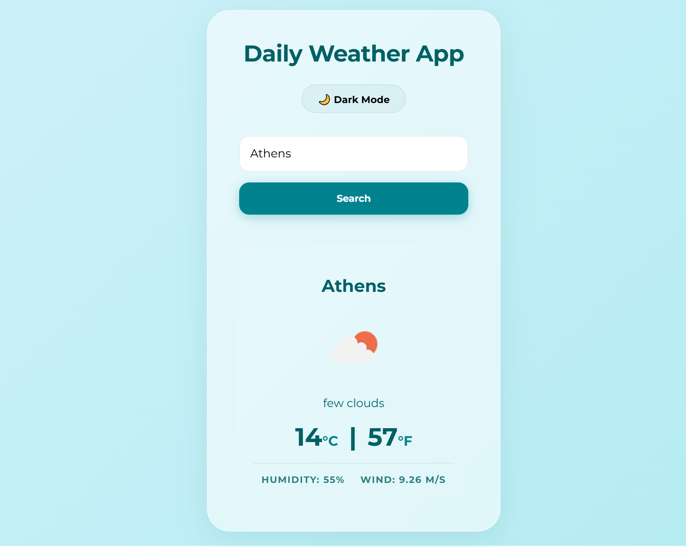
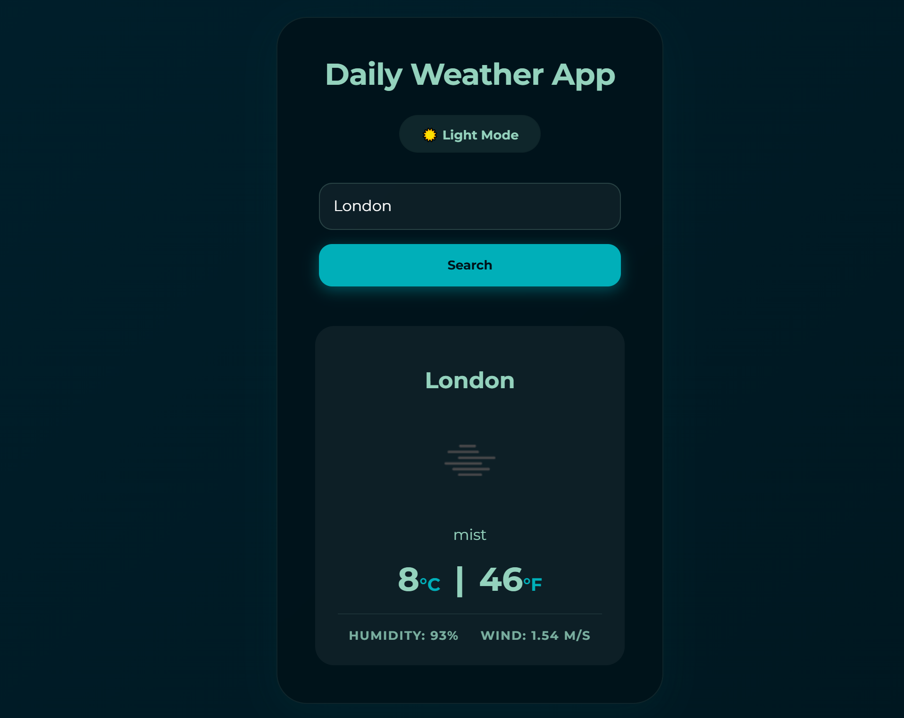

# 🌦️ React Weather App

A modern, sleek, and highly responsive weather application built with **React** and **OpenWeatherMap API**. Featuring a custom-designed **Deep Sea** theme with glassmorphism effects and dynamic background gradients.

🔗 **Live Demo:** [https://Alda-Kst.github.io/react-weather-app](https://Alda-Kst.github.io/react-weather-app)

---

## ✨ Features

- 🔍 **Real-time Search:** Instant weather updates by city name.
- 🌡️ **Dual Temperature:** Displays temperature in both Celsius (°C) and Fahrenheit (°F).
- 💧 **Detailed Metrics:** Includes Humidity levels and Wind Speed (m/s).
- 🌊 **Deep Sea UI:** A premium aesthetic using custom Teal and Midnight Blue palettes.
- 🌙 **Adaptive Modes:** Seamless toggle between Light and Dark modes for better UX.
- 📱 **Mobile Responsive:** Fully optimized for all screen sizes and devices.
- 🌀 **Smooth Animations:** Dynamic background gradients and interactive transitions.

---

## 🛠️ Technologies Used

- **React** (Functional Components, Hooks: `useState`, `useEffect`)
- **Axios:** For handling asynchronous API requests.
- **CSS3:** Custom styling with Flexbox, Glassmorphism, and Keyframe Animations.
- **OpenWeatherMap API:** For fetching real-time global weather data.
- **Google Fonts:** Montserrat for a clean, modern typography.

---

## 📸 Preview

| Light Deep Sea                            | Dark Deep Sea                           |
| ----------------------------------------- | --------------------------------------- |
|  |  |

---

## 📦 Getting Started

### ✅ Prerequisites

- **Node.js** and **npm** installed  
  [Download Node.js](https://nodejs.org)

### 📥 Installation

1. **Clone the repository:**
   ```bash
   git clone [https://github.com/Alda-Kst/react-weather-app.git](https://github.com/Alda-Kst/react-weather-app.git)
   cd react-weather-app
   ```
2. **Install dependencies:**
   npm install
3. **Environment Variables:**
   Create a .env file in the root directory and add your API key:
   REACT_APP_WEATHER_API_KEY=your_openweather_api_key_here
4. **Run the application:**
   npm start
